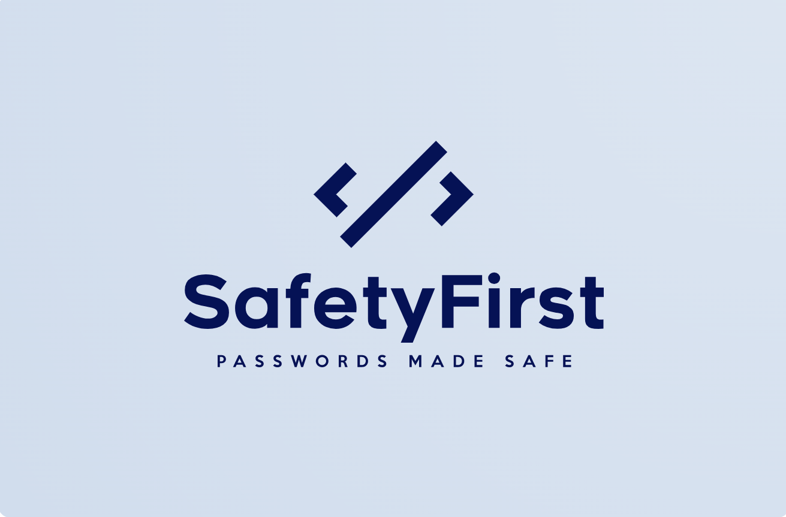
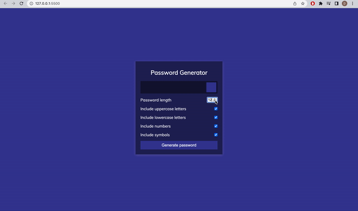

<<<<<<< HEAD



`Safety First` is the easiest way to securely create a password.




**Usage**
---

```
Usage: stronghold.py [OPTIONS]

  Securely configure your Password.
  Developed by Rhys Ward -> (Github: Rhys-ward)


Options:
  - Password length
  - Generate passwords with lowercase/uppercase
  - Generate Passwords with symbols 
 
```


=======
# Password-Generator
>>>>>>> 8a3fdd6ae48a2ffac1c2efd1c8baabd48b142350
